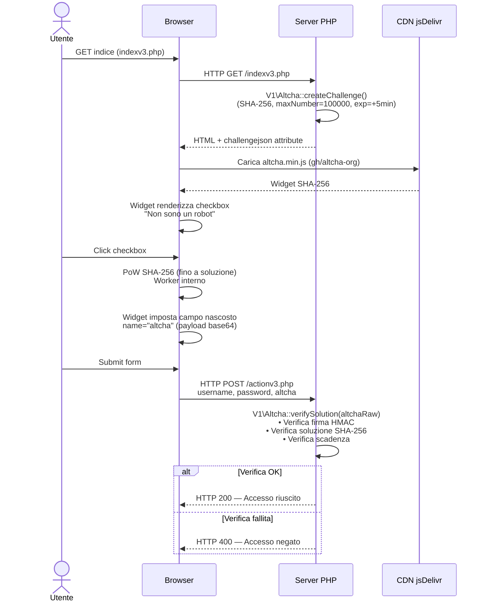
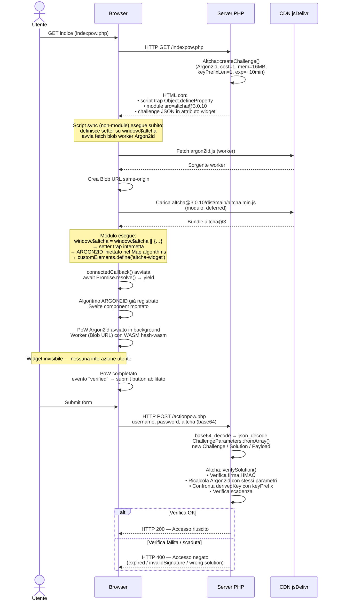
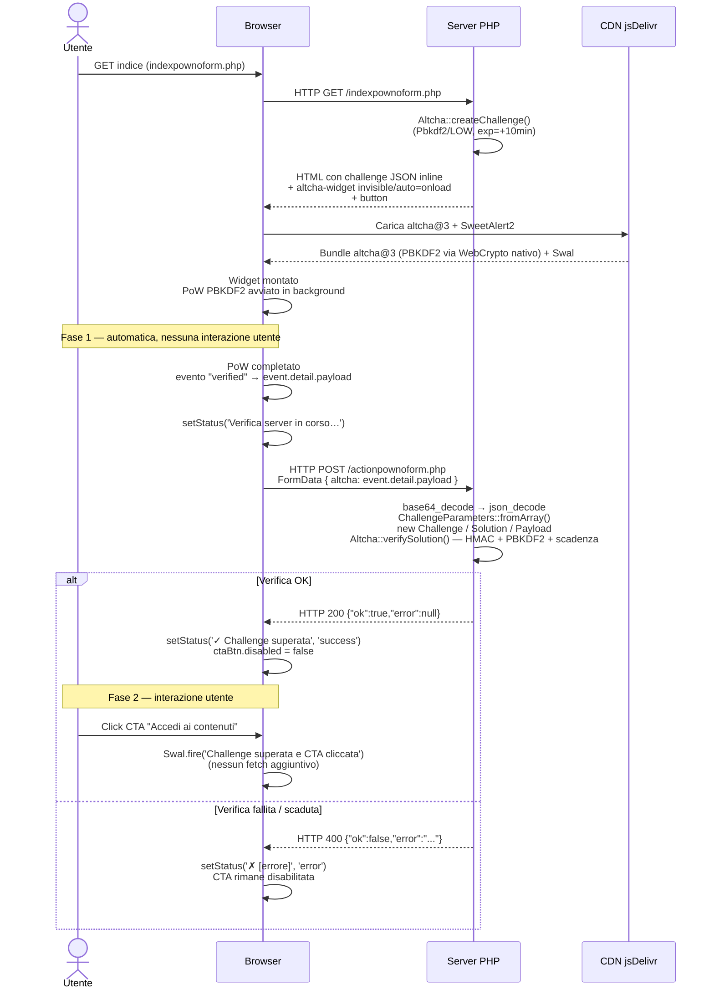

# ALTCHA Demo — Integrazioni PHP

Demo di due strategie di integrazione della libreria [ALTCHA](https://altcha.org/) in PHP, con widget frontend e verifica server-side.

---

## Indice

- [Requisiti](#requisiti)
- [Installazione](#installazione)
- [Struttura del progetto](#struttura-del-progetto)
- [Integrazione 1 — Widget v3 visibile (SHA-256)](#integrazione-1--widget-v3-visibile-sha-256)
- [Integrazione 2 — Widget PoW invisibile (Argon2id)](#integrazione-2--widget-pow-invisibile-argon2id)
- [Integrazione 3 — PoW PBKDF2 invisibile senza form (fetch + JSON)](#integrazione-3--pow-pbkdf2-invisibile-senza-form-fetch--json)
- [Sequence diagram — Widget v3](#sequence-diagram--widget-v3)
- [Sequence diagram — PoW Argon2id invisibile](#sequence-diagram--pow-argon2id-invisibile)
- [Sequence diagram — PoW PBKDF2 senza form](#sequence-diagram--pow-pbkdf2-senza-form)
- [Parametri di configurazione](#parametri-di-configurazione)
- [Come il PoW limita i bot](#come-il-pow-limita-i-bot)
- [Scelta dell'algoritmo: PBKDF2 vs Argon2id](#scelta-dellalgoritmo-pbkdf2-vs-argon2id)
- [Note di sicurezza](#note-di-sicurezza)

---

## Requisiti

| Componente | Versione minima |
|---|---|
| PHP | 8.1 |
| Estensione `ext-sodium` | inclusa in PHP 8.1+ |
| Composer | 2.x |

Verificare che `ext-sodium` sia abilitata:

```bash
php -m | grep sodium
```

---

## Installazione

```bash
git clone <repository>
cd altcha-demo-contact-form
composer install
```

La libreria `altcha-org/altcha ^2.0` viene installata tramite Composer. Non sono necessarie altre dipendenze runtime.

---

## Struttura del progetto

```
.
├── indexv3.php            # Form con widget ALTCHA v3 visibile (SHA-256)
├── actionv3.php           # Verifica server-side challenge v3
├── indexpow.php           # Form con widget ALTCHA PoW invisibile (Argon2id)
├── actionpow.php          # Verifica server-side challenge Argon2id
├── indexpow2.php          # Form con widget ALTCHA PoW invisibile (PBKDF2)
├── actionpow2.php         # Verifica server-side challenge PBKDF2
├── indexpownoform.php     # CTA senza form — PoW PBKDF2 invisibile, invio via fetch()
├── actionpownoform.php    # Verifica server-side PBKDF2, risponde in JSON
├── composer.json
└── vendor/
    └── altcha-org/altcha/   # Libreria PHP ALTCHA v2.0.x
```

---

## Integrazione 1 — Widget v3 visibile (SHA-256)

**File:** `indexv3.php` + `actionv3.php`

### Come funziona

Il server genera una challenge SHA-256 tramite l'API V1 della libreria. Il widget viene reso nel form come checkbox "Non sono un robot": l'utente risolve il PoW cliccando, dopodiché può inviare il form. Il server verifica la soluzione in `actionv3.php`.

### Generazione della challenge (indexv3.php)

```php
use AltchaOrg\Altcha\V1\Altcha as AltchaV1;
use AltchaOrg\Altcha\V1\ChallengeOptions;

const HMAC_KEY = 'altcha-v3-demo-secret-key-averelaquintaelementarenonèuntraguardomaunpiccoloebanalepuntodipartenza';

$altcha = new AltchaV1(hmacKey: HMAC_KEY);
$challenge = $altcha->createChallenge(new ChallengeOptions(
    maxNumber: 100000,
    expires: new DateTimeImmutable('+5 minutes'),
));
```

La challenge viene serializzata in JSON nel formato flat atteso dal widget v3:

```php
$challengeJson = htmlspecialchars(json_encode([
    'algorithm' => $challenge->algorithm,
    'challenge' => $challenge->challenge,
    'maxnumber' => $challenge->maxNumber,
    'salt'      => $challenge->salt,
    'signature' => $challenge->signature,
], JSON_UNESCAPED_SLASHES | JSON_UNESCAPED_UNICODE), ENT_QUOTES, 'UTF-8');
```

### Widget HTML

```html
<!-- Widget CDN (v3 SHA-based) -->
<script async defer
    src="https://cdn.jsdelivr.net/gh/altcha-org/altcha/dist/altcha.min.js"
    type="module">
</script>

<altcha-widget
    challengejson="<?php echo $challengeJson ?>"
    strings='{"label":"Non sono un robot","verified":"Verificato",...}'>
</altcha-widget>
```

> **Nota:** per questa versione del widget (`cdn.jsdelivr.net/gh/altcha-org/altcha/dist/altcha.min.js`) l'attributo per la challenge inline è `challengejson`, non `challenge`.

### Verifica server-side (actionv3.php)

```php
use AltchaOrg\Altcha\V1\Altcha as AltchaV1;

$altchaRaw = filter_input(INPUT_POST, 'altcha');   // payload base64 dal widget

$altcha   = new AltchaV1(hmacKey: HMAC_KEY);
$verified = $altcha->verifySolution($altchaRaw);   // bool
```

`verifySolution()` controlla internamente:
- Validità della firma HMAC sulla challenge
- Correttezza della soluzione SHA-256
- Scadenza della challenge (se impostata via `expires`)

---

## Integrazione 2 — Widget PoW invisibile (Argon2id)

**File:** `indexpow.php` + `actionpow.php`

### Come funziona

Il server genera una challenge Argon2id tramite l'API V2 della libreria. Il widget è **invisibile**: appena la pagina si carica, risolve il PoW in background tramite un Web Worker. Solo a completamento avvenuto il pulsante di invio viene abilitato. L'utente non interagisce con il widget.

### Generazione della challenge (indexpow.php)

```php
use AltchaOrg\Altcha\Algorithm\Argon2id;
use AltchaOrg\Altcha\Altcha;
use AltchaOrg\Altcha\CreateChallengeOptions;

const HMAC_KEY_POW = 'altcha-pow-argon2id-demo-key-averelaquintaelementarenonèuntraguardomaunpiccoloebanalepuntodipartenza';

$altcha = new Altcha(hmacSignatureSecret: HMAC_KEY_POW);
$challenge = $altcha->createChallenge(new CreateChallengeOptions(
    algorithm: new Argon2id(),
    cost: 1,
    memoryCost: 16384,   // 16 MB (in KB)
    keyPrefixLength: 1,  // prefisso 1 byte → ~256 tentativi medi
    expiresAt: new DateTimeImmutable('+10 minutes'),
));
$challengeJsonRaw = $challenge->toJson();
```

### Registrazione algoritmo ARGON2ID nel browser

Il widget `altcha@3` bundla solo SHA e PBKDF2. Argon2id deve essere registrato manualmente. Due vincoli da rispettare:

1. **Cross-origin Worker:** i browser bloccano `new Worker('https://cdn.jsdelivr.net/...')`. Soluzione: fetch del worker → Blob → `URL.createObjectURL()`.
2. **Race condition:** `connectedCallback` del widget si avvia durante `customElements.define()`, prima che il nostro codice JS possa registrare l'algoritmo. Soluzione: intercettare l'inizializzazione di `$altcha` tramite `Object.defineProperty` setter.

```html
<!-- Script 1: trap sincrono — deve precedere il modulo altcha -->
<script>
    (function () {
        var blobUrlReady = fetch('https://cdn.jsdelivr.net/npm/altcha@3.0.10/dist/workers/argon2id.js')
            .then(function (r) { return r.text(); })
            .then(function (t) {
                return URL.createObjectURL(new Blob([t], { type: 'application/javascript' }));
            });

        // Il modulo altcha esegue: globalThis.$altcha = globalThis.$altcha || {...}
        // Intercettiamo quell'assegnazione per iniettare ARGON2ID nel Map algorithms
        // prima che customElements.define() venga chiamato.
        Object.defineProperty(window, '$altcha', {
            configurable: true,
            enumerable: true,
            get: function () { return undefined; },
            set: function (val) {
                // Rimuove il trap (evita ricorsione) e ripristina come property normale
                Object.defineProperty(window, '$altcha', {
                    value: val, writable: true, configurable: true, enumerable: true
                });
                if (val && val.algorithms) {
                    val.algorithms.set('ARGON2ID', function () {
                        return blobUrlReady.then(function (url) { return new Worker(url); });
                    });
                }
            }
        });
    }());
</script>

<!-- Script 2: carica il modulo altcha (deferred automaticamente) -->
<script type="module"
    src="https://cdn.jsdelivr.net/npm/altcha@3.0.10/dist/main/altcha.min.js">
</script>
```

### Widget HTML

```html
<altcha-widget
    id="altchaWidget"
    display="invisible"
    auto="onload"
    challenge="<?php echo  htmlspecialchars($challengeJsonRaw, ENT_QUOTES, 'UTF-8') ?>"
    name="altcha">
</altcha-widget>
```

- `display="invisible"` — nasconde completamente il widget dalla UI
- `auto="onload"` — avvia il PoW automaticamente al caricamento
- `challenge` — JSON della challenge inline (il widget lo riconosce perché inizia con `{`)

### Abilitazione del pulsante a completamento

```javascript
document.getElementById('altchaWidget').addEventListener('verified', function () {
    document.getElementById('submitBtn').disabled = false;
});
```

### Verifica server-side (actionpow.php)

Il payload del widget v2 è un JSON base64 con struttura nidificata:

```json
{
  "challenge": { "parameters": {...}, "signature": "..." },
  "solution":  { "counter": 123, "derivedKey": "abc123..." }
}
```

```php
use AltchaOrg\Altcha\Algorithm\Argon2id;
use AltchaOrg\Altcha\Altcha;
use AltchaOrg\Altcha\Challenge;
use AltchaOrg\Altcha\ChallengeParameters;
use AltchaOrg\Altcha\Payload;
use AltchaOrg\Altcha\Solution;
use AltchaOrg\Altcha\VerifySolutionOptions;

$json = base64_decode(filter_input(INPUT_POST, 'altcha'), true);
$data = json_decode($json, true);

$params    = ChallengeParameters::fromArray($data['challenge']['parameters']);
$challenge = new Challenge($params, $data['challenge']['signature']);
$solution  = new Solution(
    (int)    $data['solution']['counter'],
    (string) $data['solution']['derivedKey'],
);
$payload = new Payload($challenge, $solution);

$altcha = new Altcha(hmacSignatureSecret: HMAC_KEY_POW);
$result = $altcha->verifySolution(new VerifySolutionOptions(
    payload:   $payload,
    algorithm: new Argon2id(),
));

$verified = $result->verified;
// $result->expired          → true se la challenge è scaduta
// $result->invalidSignature → true se la firma HMAC non corrisponde
```

---

## Integrazione 3 — PoW PBKDF2 invisibile senza form (XHR + SweetAlert2)

**File:** `indexpownoform.php` + `actionpownoform.php`

### Come funziona

Stesso algoritmo PBKDF2, ma senza alcun elemento `<form>` e con un flusso a due fasi ben distinte:

1. **Fase 1 — verifica automatica:** il widget risolve il PoW in background; quando emette `verified`, il JS invia immediatamente il payload al server via XHR. La CTA rimane disabilitata finché il server non risponde `ok: true`.
2. **Fase 2 — azione utente:** solo dopo la conferma server il bottone si abilita. Il click non invia nulla: mostra esclusivamente un alert SweetAlert2.

La verifica avviene quindi **prima** che l'utente possa interagire con la CTA, e il click è un'azione pura di UI, già "garantita" dal server.

Questo pattern è utile per proteggere azioni puntuali (download, accesso a risorsa, invocazione API) che non corrispondono a un form HTML tradizionale.

### Generazione della challenge (indexpownoform.php)

```php
use AltchaOrg\Altcha\Algorithm\Pbkdf2;
use AltchaOrg\Altcha\Altcha;
use AltchaOrg\Altcha\CreateChallengeOptions;
use Shady\Altcha\Enum\Pbkdf2Difficulty;

const HMAC_KEY_POWNOFORM = '...';

$difficulty       = Pbkdf2Difficulty::LOW;   // configurabile: LOW → VERY_HIGH
$altcha           = new Altcha(hmacSignatureSecret: HMAC_KEY_POWNOFORM);
$challenge        = $altcha->createChallenge(new CreateChallengeOptions(
    algorithm:       new Pbkdf2($difficulty->hmacAlgorithm()),
    cost:            $difficulty->cost(),
    keyPrefixLength: $difficulty->keyPrefixLength(),
    expiresAt:       new DateTimeImmutable('+10 minutes'),
));
$challengeJsonRaw = $challenge->toJson();
```

### Widget e CTA HTML

Il widget non ha l'attributo `name` (inutile senza form). Il bottone parte disabilitato.

```html
<!-- SweetAlert2 deve essere caricato prima del modulo altcha -->
<script src="https://cdn.jsdelivr.net/npm/sweetalert2@11"></script>
<script type="module" src="https://cdn.jsdelivr.net/npm/altcha@3.0.10/dist/main/altcha.min.js"></script>

<altcha-widget
    id="altchaWidget"
    display="invisible"
    auto="onload"
    challenge="<?php echo htmlspecialchars($challengeJsonRaw, ENT_QUOTES, 'UTF-8'); ?>">
</altcha-widget>

<p id="powStatus">
    <!-- aggiornato via JS -->
</p>

<button type="button" id="ctaBtn" disabled>
    Accedi ai contenuti
</button>
```

### Logica JavaScript

Il JS è strutturato in due blocchi indipendenti che rispecchiano le due fasi del flusso.

```javascript
const widget    = document.getElementById('altchaWidget');
const powStatus = document.getElementById('powStatus');
const ctaBtn    = document.getElementById('ctaBtn');

// ─── Helpers ────────────────────────────────────────────────────────────────

function setStatus(text, type = 'neutral') {
    powStatus.textContent = text;
    // applica classe CSS success / error / neutral
}

async function verifyWithServer(payload) {
    const body = new FormData();
    body.append('altcha', payload);
    const response = await fetch('actionpownoform.php', { method: 'POST', body });
    return response.json();   // { ok: bool, error: string|null }
}

// ─── Fase 1: PoW completato → verifica lato server via XHR ──────────────────

widget.addEventListener('verified', async function (event) {
    const payload = event.detail?.payload;

    setStatus('Verifica server in corso…', 'loading');

    try {
        const result = await verifyWithServer(payload);

        if (result.ok) {
            setStatus('✓ Challenge superata — puoi procedere.', 'success');
            ctaBtn.disabled = false;
        } else {
            setStatus('✗ ' + (result.error ?? 'Verifica fallita.'), 'error');
        }
    } catch (err) {
        setStatus('✗ Errore di rete. Ricarica la pagina.', 'error');
    }
});

widget.addEventListener('error', function () {
    setStatus('✗ PoW fallito. Ricarica la pagina.', 'error');
});

// ─── Fase 2: CTA cliccata → SweetAlert2 (nessun fetch aggiuntivo) ────────────

ctaBtn.addEventListener('click', function () {
    Swal.fire({
        title: 'Challenge superata e CTA cliccata',
        icon: 'success',
    });
});
```

> **Perché `event.detail.payload` e non `widget.value`?**
> Fuori da un `<form>`, `widget.value` è una proprietà interna del web component non garantita come interfaccia pubblica stabile — in certi browser/versioni può risultare `undefined`. `event.detail.payload` è il canale ufficiale per leggere il payload in modo programmatico: emesso direttamente nell'evento `verified`, viene catturato nel momento esatto in cui è disponibile, senza dipendenze da timing o da proprietà del DOM.

### Verifica server-side e risposta JSON (actionpownoform.php)

L'action non produce HTML: risponde sempre con JSON e imposta HTTP 400 in caso di fallimento.

```php
header('Content-Type: application/json; charset=UTF-8');

if ('POST' !== filter_input(INPUT_SERVER, 'REQUEST_METHOD')) {
    http_response_code(405);
    echo json_encode(['ok' => false, 'error' => 'Metodo non consentito.']);
    exit;
}

// ... decode e verifica identiche a actionpow2.php ...

if (!$verified) {
    http_response_code(400);
}

echo json_encode(['ok' => $verified, 'error' => $errorMsg]);
```

Struttura della risposta:

| Campo   | Tipo           | Descrizione                                              |
|---------|----------------|----------------------------------------------------------|
| `ok`    | `bool`         | `true` se la challenge è valida e non scaduta            |
| `error` | `string\|null` | Messaggio di errore leggibile; `null` se verificato      |

---

## Sequence diagram — Widget v3



---

## Sequence diagram — PoW Argon2id invisibile



---

## Sequence diagram — PoW PBKDF2 senza form



---

## Parametri di configurazione

### API V1 — Widget visibile (SHA)

| Parametro | Default | Descrizione |
|---|---|---|
| `algorithm` | `SHA-256` | Algoritmo hash (`SHA-1`, `SHA-256`, `SHA-512`) |
| `maxNumber` | `1.000.000` | Limite superiore del numero da trovare. Valori più alti → più difficoltà |
| `expires` | `null` | Scadenza della challenge (`DateTimeImmutable`) |
| `saltLength` | `12` | Lunghezza del salt casuale in byte |

### API V2 — Widget PoW Argon2id invisibile

| Parametro | Default | Descrizione |
|---|---|---|
| `algorithm` | — | Istanza `Argon2id` (o `Pbkdf2`, `Scrypt`) |
| `cost` | — | Numero di iterazioni Argon2id |
| `memoryCost` | `null` | Memoria in KB (es. `16384` = 16 MB) |
| `keyPrefixLength` | `null` | Byte del prefisso da indovinare. `1` → ~256 tentativi medi; `2` → ~65.536 |
| `keyLength` | `32` | Lunghezza della chiave derivata in byte |
| `expiresAt` | `null` | Scadenza come `DateTimeImmutable` o timestamp Unix |
| `parallelism` | `null` | Grado di parallelismo Argon2id |

### Preset di difficoltà — `Pbkdf2Difficulty`

L'enum `src/Enum/Pbkdf2Difficulty.php` definisce cinque livelli predefiniti basati su PBKDF2.
Il lavoro totale per risoluzione è `cost × 256^keyPrefixLength` operazioni HMAC.

| Livello       | cost    | keyPrefixLength | Algoritmo | Tentativi medi | Ops totali  |
|---------------|---------|-----------------|-----------|----------------|-------------|
| `LOW`         |  10.000 |        1        | SHA-256   |            256 |    ~2,56 M  |
| `MEDIUM`      |  50.000 |        2        | SHA-384   |         65.536 |    ~3,28 B  |
| `MEDIUM_HIGH` |  75.000 |        2        | SHA-512   |         65.536 |    ~4,92 B  |
| `HIGH`        | 100.000 |        2        | SHA-512   |         65.536 |    ~6,55 B  |
| `VERY_HIGH`   | 200.000 |        3        | SHA-512   |     16.777.216 |    ~3,36 T  |

> `Ops totali` misura il **conteggio** delle derivazioni HMAC, indipendentemente dall'algoritmo.
> L'algoritmo più pesante (SHA-512 vs SHA-256) incide sul tempo per operazione, non sul conteggio.

### Linee guida sulla difficoltà PoW

| Caso d'uso | `keyPrefixLength` | Durata media browser |
|---|---|---|
| Anti-spam leggero | `1` | ~1–3 secondi |
| Login protetto | `2` | ~10–30 secondi |
| Registrazione ad alto rischio | `3` | ~3–10 minuti |

---

## Come il PoW limita i bot

### Il principio: asimmetria computazionale

Un sistema di Proof of Work impone al **client** di risolvere un puzzle computazionale prima che la sua richiesta venga accettata dal server. Il costo è distribuito in modo deliberatamente asimmetrico:

| Operazione | Costo |
|---|---|
| Risolvere il puzzle (client) | Alto — decine di milioni di operazioni hash |
| Verificare la soluzione (server) | Trascurabile — una singola derivazione |

Il server non computa nulla finché il client non presenta una soluzione valida.

### Perché penalizza i bot e non gli utenti

Un utente umano carica la pagina una volta e aspetta pochi secondi che il widget risolva il PoW in background. Il costo è impercettibile.

Un bot che vuole inondare un endpoint deve invece risolvere un puzzle per **ogni singola richiesta**. Con un livello `MEDIUM` (~3,28 miliardi di operazioni HMAC), un server da 4 core capace di eseguire 10.000 derivazioni/secondo impiegherebbe circa **9 ore di CPU** per generare un milione di richieste valide. Lo stesso volume, senza PoW, richiederebbe frazioni di secondo.

```
Senza PoW:  1.000.000 richieste/ora  →  triviale
Con PoW:    1.000.000 richieste/ora  →  richiede ~9.000 core-hour di CPU
```

### Il checkbox "sono un essere umano" blocca i bot?

No. Il checkbox è un elemento UX, non un meccanismo di sicurezza.

Il PoW viene risolto da JavaScript nel browser: un bot non deve "cliccare" nel senso umano — Puppeteer, Playwright e Selenium simulano un click in una riga di codice, dopodiché il widget esegue esattamente lo stesso JavaScript che esegue un utente reale.

Un bot sofisticato può inoltre bypassare completamente il widget:

```
Bot naïve:      load page → click checkbox → wait PoW → submit
Bot sofisticato: fetch challenge JSON → risolve PoW lato server → POST diretto
```

Nel secondo caso non serve nemmeno un browser: il bot chiama direttamente l'endpoint di generazione challenge, risolve il puzzle con la stessa matematica, e fa il POST. Con o senza checkbox, la protezione rimane esclusivamente economica — il costo computazionale per richiesta.

### Differenza rispetto ad altri meccanismi

| Meccanismo | Esperienza utente | Protezione effettiva | Privacy |
|---|---|---|---|
| PoW invisibile (ALTCHA) | Nessuna | Rate limiting computazionale | Nessun dato trasmesso a terzi |
| PoW con checkbox (ALTCHA) | Click simulabile in 1 riga | Rate limiting computazionale | Nessun dato trasmesso a terzi |
| reCAPTCHA v3 | Nessuna | Rate limiting + analisi comportamentale ML | Dati inviati a Google |
| CAPTCHA visivo classico | Interazione richiesta | Rate limiting + riconoscimento immagini | Dipende dal provider |
| Rate limiting IP | Nessuna | Bassa (aggirabile con VPN/proxy) | Nessun impatto |

Il vantaggio di ALTCHA rispetto a reCAPTCHA non è una protezione maggiore — è la **privacy**: nessun dato inviato a Google, nessun cookie di tracciamento. Il trade-off è che la protezione è solo economica, non comportamentale.

### Il PoW come rate limiter naturale

Il PoW **non blocca** un bot lento: lo rallenta. Un bot con poca CPU risolverà comunque ogni challenge, ma ci metterà più tempo — e questo limita naturalmente il numero di richieste che riesce a inviare.

Con un livello `MEDIUM` (~3,28 B ops), il throughput massimo dipende dalla potenza del client:

| Client | Tempo per challenge | Richieste/ora massime |
|---|---|---|
| Browser moderno | ~2 secondi | ~1.800 |
| Bot CPU low-end | ~30 secondi | ~120 |
| Bot CPU high-end | ~1 secondo | ~3.600 |

Il PoW trasforma il rate limiting da un problema **tuo** (quante richieste accetto?) a un problema **loro** (quanta CPU hanno?). Il throughput del bot è capped dall'algoritmo, non dalla tua logica applicativa.

Un rate limit classico a 10 req/ora è facile da aggirare ruotando IP o proxy. Un PoW che fisicamente richiede 30 secondi per richiesta è molto più difficile da scalare senza investire in hardware.

### Limiti del PoW

Il PoW **non è una difesa assoluta**:

- **Botnet distribuite**: se i bot sono distribuiti su migliaia di macchine, il costo per nodo si riduce proporzionalmente.
- **Hardware dedicato**: GPU e ASIC possono accelerare certi algoritmi. PBKDF2 e Argon2id sono progettati per resistere, ma non sono immuni.
- **Nonce reuse**: senza uno store dei nonce già verificati, la stessa soluzione può essere riutilizzata entro la scadenza della challenge. Vedere [Note di sicurezza](#note-di-sicurezza).

Il PoW è efficace per **alzare il costo economico** degli attacchi volumetrici, non per eliminarli. Va combinato con rate limiting, validazione dell'input e monitoraggio del traffico.

---

## Scelta dell'algoritmo: PBKDF2 vs Argon2id

### La differenza fondamentale: CPU-bound vs memory-hard

**PBKDF2** è *CPU-bound*: il costo scala con le iterazioni (`cost`), ma ogni iterazione usa pochissima RAM. Questo lo rende facilmente parallelizzabile su GPU e ASIC, che possono eseguire migliaia di derivazioni in parallelo a basso costo energetico.

**Argon2id** è *memory-hard*: ogni derivazione occupa un blocco di RAM (`memoryCost`). Le GPU hanno molta potenza di calcolo ma poca RAM per core — un RTX 4090 ha 24 GB totali ma centinaia di core che devono condividerla. Con `memoryCost=64MB`, possono girare al massimo ~375 derivazioni in parallelo su quella GPU. L'effetto parallelizzazione crolla.

### Tabella comparativa

| Criterio | PBKDF2 | Argon2id |
|---|---|---|
| Resistenza GPU/ASIC | Bassa | Alta |
| RAM richiesta per operazione | ~KB | Configurabile (MB) |
| Supporto nativo browser | Sì (Web Crypto API) | No (richiede WASM) |
| Complessità di configurazione | 1 parametro (`cost`) | 3 parametri (`cost`, `memoryCost`, `parallelism`) |
| Prevedibilità su mobile | Alta | Variabile — RAM limitata |
| Standard | RFC 2898 | RFC 9106, vincitore PHC 2015 |

### Quando scegliere PBKDF2

- Il threat model sono **bot con CPU comuni** (server low-cost, VM cloud) — non GPU farm
- Serve **massima compatibilità** (nessun WASM, nessuna dipendenza aggiuntiva nel browser)
- Il PoW deve girare su **dispositivi mobili** con RAM limitata senza rischio OOM
- Vuoi controllare la difficoltà con un solo parametro (`cost`) in modo lineare e prevedibile

In questo progetto `Pbkdf2Difficulty` copre esattamente questo caso: la difficoltà è scalata via `cost` + `keyPrefixLength`, con SHA-384/SHA-512 per rallentare le iterazioni lato hardware.

### Quando scegliere Argon2id

- Il threat model include **botnet con GPU** o hardware specializzato
- Puoi accettare la complessità aggiuntiva (WASM worker, Blob URL, tre parametri da bilanciare)
- Il PoW gira principalmente su **desktop** con RAM abbondante
- Vuoi la massima resistenza per endpoint ad alto rischio (es. registrazione, reset password)

### Regola pratica

| Scenario | Algoritmo consigliato |
|---|---|
| Bot economici (cloud VM, CPU comuni) | PBKDF2 `HIGH` o `VERY_HIGH` |
| Bot con GPU farm | Argon2id, `memoryCost` ≥ 32 MB |
| Mobile-first, bassa latenza | PBKDF2 `LOW` o `MEDIUM` |
| Massima sicurezza, utenza desktop | Argon2id, `memoryCost` ≥ 64 MB |

Questo progetto implementa entrambi: PBKDF2 tramite `Pbkdf2Difficulty` e Argon2id in `indexpow.php`. È possibile scegliere l'algoritmo per singolo endpoint in base al livello di rischio specifico.

---

## Note di sicurezza

- **HMAC key**: le costanti `HMAC_KEY` e `HMAC_KEY_POW` devono essere mosse in variabili d'ambiente (`.env`) in produzione. Non committare mai le chiavi nel repository.
- **Replay attack**: la libreria controlla la scadenza ma **non gestisce un nonce store** per prevenire il riuso della stessa soluzione. In produzione occorre memorizzare i nonce verificati (es. in Redis/database) per la durata della validità della challenge.
- **HTTPS**: il payload `altcha` viaggia nel body POST; usare sempre HTTPS per evitare intercettazioni.
- **Argon2id `memoryCost`**: valori alti (> 64 MB) possono mettere sotto pressione dispositivi mobili o browser con memoria limitata. Testare su hardware target prima del deploy.
- **CDN integrity**: in produzione valutare l'aggiunta dell'attributo `integrity` (Subresource Integrity) ai tag `<script>` che caricano da CDN.
