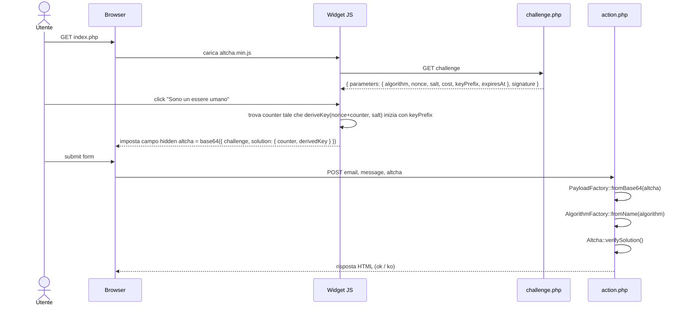
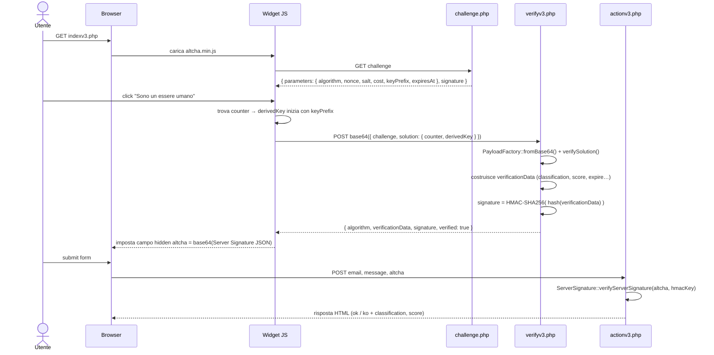
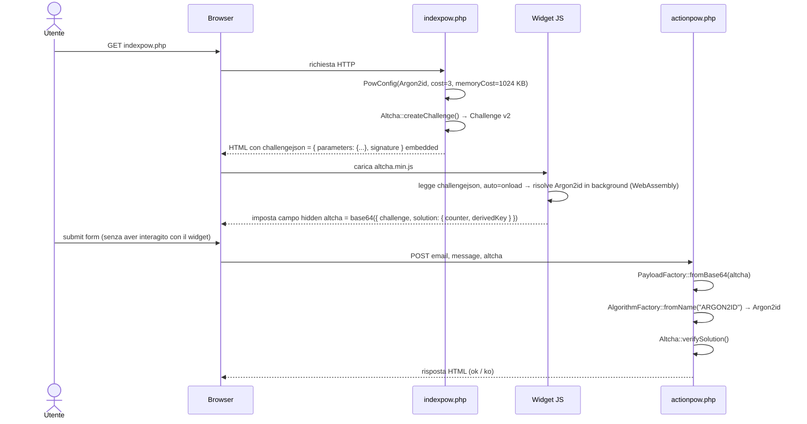

# ALTCHA Demo Contact Form

A demonstration implementation of [ALTCHA](https://altcha.org) — a free, open-source CAPTCHA alternative that protects your forms from spam and abuse without requiring users to solve puzzles or identify images.

## Integrazioni disponibili

| Pagina | Tipo | Algoritmo default | Flusso |
|---|---|---|---|
| `index.php` | Widget standard | SHA-256 | challenge → PoW → `verifySolution()` |
| `indexv3.php` | Widget con Server Signature | SHA-256 | challenge → PoW → `verifyv3.php` → `verifyServerSignature()` |
| `indexpow.php` | Solo PoW (challenge inline, invisible) | **Argon2id** | challenge embedded → PoW auto → `verifySolution()` |

## 🌟 Features

- **Privacy-Friendly**: No tracking, no cookies, no data collection
- **Accessible**: Works for all users without visual challenges or puzzle-solving
- **Lightweight**: Minimal impact on page load times
- **Self-Hosted**: Complete control over your implementation
- **Multi-algorithm PoW**: SHA-256/384/512, PBKDF2, Argon2id, Scrypt

## 📋 Requirements

- PHP 8.1 or higher
- `ext-sodium` (standard in PHP 8+, required for Argon2id)
- Web server with SSL/HTTPS enabled (required for ALTCHA to function)
- Composer (for dependency management)

## 🚀 Installation

1. **Clone the repository**
   ```bash
   git clone https://github.com/snipershady/altcha-demo-contact-form.git
   cd altcha-demo-contact-form
   ```

2. **Install dependencies**
   ```bash
   composer install
   ```

3. **Configure your secret key**

   ⚠️ **Important**: The included secret key is for demonstration purposes only. For production use, generate a strong alphanumeric secret key of at least 64-128 characters and replace it in all relevant files (`challenge.php`, `action.php`, `verifyv3.php`, `actionv3.php`, `indexpow.php`, `actionpow.php`).

4. **Set up SSL certificate**

   ALTCHA requires HTTPS to function properly. Options include:
   - Let's Encrypt (free, recommended for production)
   - Self-signed certificate (for local development)
   - Commercial SSL certificate

## 🏗️ Dettaglio delle integrazioni

### Widget standard — `index.php` + `challenge.php` + `action.php`

Il widget mostra un checkbox all'utente. Al click, il browser risolve il PoW con SHA-256 e include il payload nel form.

Il challenge usa il **protocollo v2**: il server restituisce un oggetto `parameters` con `nonce`, `salt`, `cost` e `keyPrefix`. Il client cerca un `counter` tale che `deriveKey(nonce + counter, salt)` inizi con `keyPrefix`.



### Widget con Server Signature — `indexv3.php` + `challenge.php` + `verifyv3.php` + `actionv3.php`

Prima di includere il token nel form, il widget invia la soluzione PoW a `verifyv3.php`, che la verifica e restituisce una **Server Signature** firmata con HMAC. Il form action riceve questa firma (non la soluzione grezza) e la verifica con `ServerSignature::verifyServerSignature()`.



### Solo PoW — `indexpow.php` + `actionpow.php`

Il challenge è generato server-side in PHP al caricamento della pagina (con **Argon2id** per default) e iniettato nell'HTML tramite `challengejson`. Il widget lo risolve automaticamente in background (`auto="onload"`, `display:none`) senza alcuna interazione dell'utente e senza chiamate AJAX aggiuntive.



Questo approccio elimina la chiamata AJAX per il challenge ed è ideale quando si vuole un'esperienza completamente trasparente per l'utente, usando Argon2id per aumentare il costo computazionale per eventuali attaccanti.

## 🔧 Configurazione PoW (`src/Config/PowConfig.php`)

Tutti i parametri del challenge sono centralizzati in `PowConfig`. Per variare difficoltà e algoritmo basta modificare il blocco in `indexpow.php`:

```php
$config = new PowConfig(
    algorithm:     HashAlgorithm::ARGON2ID,  // o SHA256, PBKDF2_SHA256, …
    cost:          3,        // iterazioni interne (time_cost per Argon2)
    keyLength:     32,       // byte della chiave derivata
    keyPrefix:     '00',     // prefisso hex da trovare (~256 tentativi medi)
    memoryCost:    1024,     // KB di RAM per tentativo (solo Argon2id/Scrypt)
    parallelism:   null,     // default lib
    expirySeconds: 120,
);
```

### Algoritmi supportati (`src/Enum/HashAlgorithm.php`)

| Case | Stringa protocollo | Ext PHP | Browser |
|---|---|---|---|
| `SHA256` | `SHA-256` | — | `crypto.subtle` |
| `SHA384` | `SHA-384` | — | `crypto.subtle` |
| `SHA512` | `SHA-512` | — | `crypto.subtle` |
| `PBKDF2_SHA256` | `PBKDF2/SHA-256` | — | `crypto.subtle` |
| `PBKDF2_SHA384` | `PBKDF2/SHA-384` | — | `crypto.subtle` |
| `PBKDF2_SHA512` | `PBKDF2/SHA-512` | — | `crypto.subtle` |
| `ARGON2ID` | `ARGON2ID` | `ext-sodium` ✅ | `hash-wasm` (WASM) |
| `SCRYPT` | `SCRYPT` | `ext-scrypt` ❌ | `hash-wasm` (WASM) |

### Guida alla difficoltà

La difficoltà è il prodotto di due fattori:

| Parametro | Effetto |
|---|---|
| `keyPrefix` | Ogni byte aggiunto moltiplica per ~256 i tentativi medi: `'00'` ≈ 256, `'0000'` ≈ 65 536 |
| `cost` | Iterazioni interne per tentativo: aumentarlo rende ogni tentativo più lento |
| `memoryCost` | (solo Argon2id/Scrypt) RAM per tentativo; rende il PoW costoso anche per GPU/ASIC |

## 🏛️ Architettura `src/`

```
src/
├── Config/
│   └── PowConfig.php          — parametri challenge (algorithm, cost, keyPrefix, …)
├── Enum/
│   └── HashAlgorithm.php      — tutti gli algoritmi; toDeriveKeyInstance(), isAvailable()
└── Factory/
    ├── AlgorithmFactory.php   — stringa algoritmo → DeriveKeyInterface
    └── PayloadFactory.php     — base64 altcha field → oggetto Payload v2
```

## 📖 Documentation

- [ALTCHA PHP Library v2](https://github.com/altcha-org/altcha-lib-php)
- [ALTCHA Widget](https://github.com/altcha-org/altcha)

## 🔒 Security Considerations

### Production Checklist

- [ ] Replace the demo secret key with a strong, randomly generated key (64-128+ characters)
- [ ] Use the **same key** in all paired files (`challenge.php` ↔ `action.php`, `verifyv3.php` ↔ `actionv3.php`, `indexpow.php` ↔ `actionpow.php`)
- [ ] Ensure HTTPS is properly configured
- [ ] Keep the `altcha-org/altcha` package updated
- [ ] Implement rate limiting on your endpoints
- [ ] Add proper input validation and sanitization
- [ ] Configure appropriate CORS headers if needed

### Secret Key Generation

```bash
# Using OpenSSL
openssl rand -base64 96

# Using PHP
php -r "echo bin2hex(random_bytes(64));"
```

## ⚠️ Important Notes

1. **SSL Requirement**: ALTCHA will NOT work without HTTPS. In local development environments without a valid SSL certificate the widget will not function.

2. **Demo Purpose**: This repository is intended for demonstration and learning purposes. Additional hardening and customization are recommended for production use.

3. **Secret Key**: Never commit your production secret key to version control. Use environment variables or secure configuration management.

4. **Challenge expiry**: Configurabile tramite `PowConfig::$expirySeconds` (default 120 s). Aumentare per form lunghi.

5. **Argon2id memory**: Il `memoryCost` default di 1024 KB è intenzionalmente basso per non sovraccaricare browser su dispositivi mobili. In produzione valutare 4096–16384 KB per maggiore sicurezza.

## 🔗 Links

- [ALTCHA Official Website](https://altcha.org)
- [ALTCHA GitHub](https://github.com/altcha-org/altcha)
- [ALTCHA PHP Library](https://github.com/altcha-org/altcha-lib-php)

---

**Note**: This is a demonstration project. For production deployments, ensure you follow security best practices and properly configure all components according to your specific requirements.
